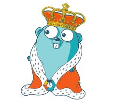

# Desafío Final

## Examen final para la asignatura **Especialización En Back End 3**

### **Docente:** _Lucas Piscitello._

### **Alumnas:** _Lorena Perez Escobar, María Cecilia Abate._
           

#### <u> Descripción del desafío </u>

**Planteo:**
_Sistema de reserva de turnos_

Se desea implementar una API que permita administrar la reserva de turnos para una clínica
odontológica. Esta debe cumplir con los siguientes requerimientos:

● **Administración de datos de odontólogos:** listar, agregar, modificar y eliminar
odontólogos. Registrar apellido, nombre y matrícula de los mismos. Se desea el
desarrollo de un CRUD para la entidad Dentista.
- POST: agregar dentista.
- GET: traer dentista por ID.
- PUT: actualizar dentista.
- PATCH: actualizar un dentista por alguno de sus campos.
- DELETE: eliminar el dentista.

● **Administración de datos de los pacientes:** listar, agregar, modificar y eliminar
pacientes. De cada uno se almacenan: nombre, apellido, domicilio, DNI y fecha de
alta. Se desea el desarrollo de un CRUD para la entidad Paciente.
- POST: agregar paciente.
- GET: traer paciente por ID.
- PUT: actualizar paciente.
- PATCH: actualizar un paciente por alguno de sus campos.
- DELETE: eliminar al paciente.

● **Registrar turno:** se tiene que poder permitir asignar a un paciente un turno con un
odontólogo a una determinada fecha y hora. Al turno se le debe poder agregar una
descripción. Se desea el desarrollo de un CRUD para la entidad Turno.
- POST: agregar turno.
- GET: traer turno por ID.
- PUT: actualizar turno.
- PATCH: actualizar un turno por alguno de sus campos.
- DELETE: eliminar turno.
- POST: agregar turno por DNI del paciente y matrícula del dentista.
- GET: traer turno por DNI del paciente. Debe traer el detalle del turno
(Fecha-Hora, descripción, Paciente y Dentista) y el dni deberá ser recibido por
QueryParams.

● **Seguridad mediante middleware:** se tiene que proveer cierta seguridad al
momento de realizar POST, PUT, PATCH y DELETE. Esta seguridad mediante
autenticación deberá estar implementada mediante un middleware.

● **Documentación de la API:** se debe proveer de la pertinente documentación de la
API mediante la implementación de Swagger.

**Requerimientos técnicos**
La aplicación debe ser desarrollada en diseño orientado a paquetes:
- Capa/dominio de entidades de negocio.
- Capa/dominio de acceso a datos (Repository).
- Capa de acceso a datos (base de datos): es la base de datos de nuestro sistema.
Podrás utilizar cualquier base de datos relacional modelado a través de un modelo
entidad-relación, como H2 o MySQL, o no relacional, como MongoDB.
- Capa/dominio service.
- Capa/dominio handler.

### __*ESTE PROYECTO ESTÁ REALIZADO EN:*__
 

